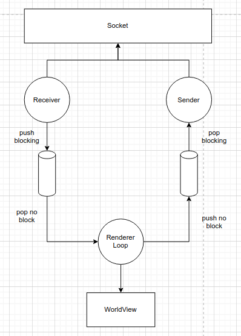
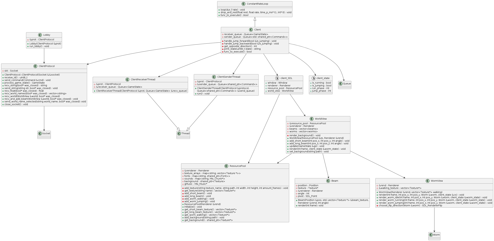
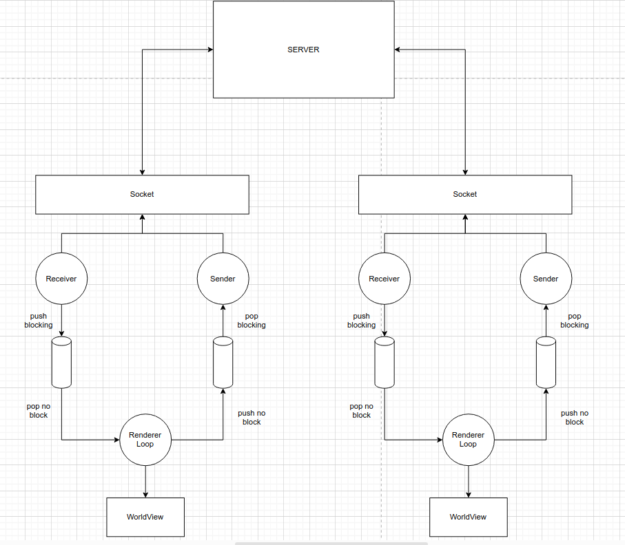
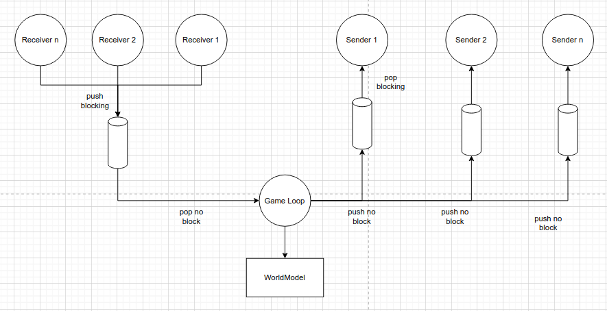
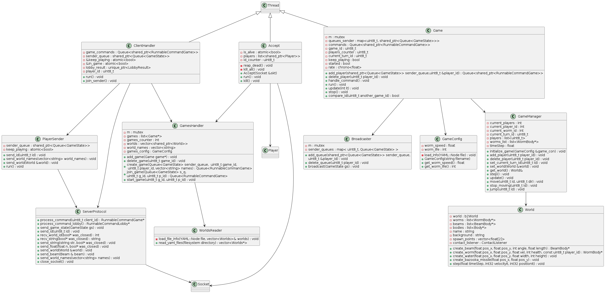

# Informe técnico sobre el tp

## Introducción

Este informe tratará sobre el lado técnico del tp, es decir, la explicación del modelo adoptado, la cantidad y tareas de los hilos, la comunicación entre cliente y servidor y cosas afines.

## Cliente



El cliente consta con una estructura de 3 hilos: 
* Sender: es el encargado de popear comandos de la sender queue y enviárselos al server, el pop es bloqueante, es decir que el hilo se quedará a la espera de que se pushee un comando a la sender queue.

* Receiver: es el encargado de recibir GameStates del server y pushearlos a la receiver queue, el push es bloqueante.

* Main: este hilo contiene al game loop y es el encargado de pushear comandos a la sender queue en caso de ser necesario; popear GameStates de la receiver queue, actualizar el estado del juego con la información del GameState y renderizar el juego. Tanto el push de comandos a la sender queue como el pop de GameStates de la receiver queue son no-bloqueantes, esto es para que el main loop pueda seguir con su ejecución. Para el manejo de eventos de teclado, se usó la función `SDL_PollEvent(Event &event)` para seguir con la lógica de que el hilo no se bloquee.

### Clases cliente

* Client: Hereda de ConstantRateLoop. Es la encargada de ejecutar el main loop, dentro de él se analiza la entrada por teclado; se envía información a la sender queue de ser necesario; se recibe el estado de juego del servidor; se actualiza el estado de juego y la vista del mundo por parte del cliente, se limpia la pantalla; y se renderiza y muestra la nueva vista del mundo.

* Lobby: Encargada de comenzar la conexión entre cliente y servidor. Recibe algunos datos básicos como el game_id, player_id, etc. que luego utilizará para la comunicación con el servidor.

* PositionConverter: convierte posiciones de metros a pixeles. Es útil cuando se reciben cosas del servidor en metros y se deben mapear a píxeles para su renderizado.

* ClientProtocol: contiene la comunicación entre el cliente y el servidor.

* ClientReceiverThread: hereda de Thread y es el hilo encargado de recibir los GameStates del servidor y pushearlos a la receiver queue.

* ClientSenderThread: hereda también de Thread y se encarga de popear los comandos de la sender queue y enviarlos al servidor

* ResourcePool: es la clase encargada de obtener y guardar las diferentes texturas que luego serán usadas para renderizar los objetos del juego. También es la encargada de guardar la música y los sonidos.

* client_SDL: es un struct que contiene la información de SDL (la ventana, el renderer, la resource pool y la world view).

* WorldView: Muestra la imagen del mundo, para esto obtiene las texturas de la resource pool y las utiliza para renderizar los objetos presentes en la pantalla.

* Beam: representa la viga y es la encargada de renderizarse.

* WormView: representa al gusano y contiene la lógica de renderizado del mismo.



## Servidor





El servidor consta de 2 hilos para la estructura del servidor:

* Main: Es el encargado de correr el server.

* ServerAccept: Este hilo se encarga de aceptar a todos los jugadores, crearles el sender_queue y crear una clase Player para cada jugador conectado, pasandole el socket aceptado y la sender_queue entre otras cosas.

Luego hay 2 hilos para cada jugador:

* ClientHandler: Hace el rol del receiver para cada jugador, recibiendo los comandos que éste le envíe por socket y ejecutandolos. Separa la logica de los comandos del lobby y los comandos de la partida. También es el que se encarga de hacerle un start al sender una vez que empezó la partida.

* PlayerSender: Es el sender de cada jugador, se queda esperando que haya algun GameState que mandar en la queue de game states y se la manda al jugador. También se encarga de mandarle cosas al jugador antes de que empiece la partida, como el id de la partida, del jugador, los posibles escenarios a elegir o el escenario elegido que tiene que renderizar.

Por último esta el hilo Game:

* Game: Tiene el loop de la logica principal del juego. También se encarga de pushear los GameState a la sender_queue de todos los jugadores.

### Clases servidor



* ServerAccept: Este hilo se encarga de aceptar a todos los jugadores, crearles el sender_queue y crear una clase Player para cada jugador conectado, pasandole el socket aceptado y la sender_queue entre otras cosas.

* ServerProtocol: contiene la comunicación entre el servidor y el cliente. Se encarga de crear y devolver los comandos.

* RunnableCommands: Son los comandos, tanto del lobby como de la partida, que ejecutan la logica de lo recibido por el jugador.

* LobbyResult: Es el resultado que devuelven los comandos, con toda la información que el ClientHandler necesita.

* Player: Contenedor de ClientHandler y PlayerSender.

* ClientHandler: Hace el rol del receiver para cada jugador, recibiendo los comandos que éste le envíe por socket y ejecutandolos. Separa la logica de los comandos del lobby y los comandos de la partida. También es el que se encarga de hacerle un start al sender una vez que empezó la partida.

* PlayerSender: Es el sender de cada jugador, se queda esperando que haya algun GameState que mandar en la queue de game states y se la manda al jugador. También se encarga de mandarle cosas al jugador antes de que empiece la partida, como el id de la partida, del jugador, los posibles escenarios a elegir o el escenario elegido que tiene que renderizar.

* GamesHandler: Contiene una lista de todos los Games y se encarga de crear las partidas, agregar a los jugadores a las partidas correspondientes y de empezar las partidas. También tiene una lista de todos los mundos posibles y se encarga de setearlos a las partidas una vez elegidos.

* Broadcaster: Se encarga de pushear el GameState del Game a cada sender_queue.

* GameManager: Es el creador del World y el que conecta la logica principal de la partida en Game con el worm y verifica si el jugador que intenta llamar a un comando es al que le pertenece el turno actual.

* Bodies: Son los bodies usados por el motor fisico Box2d y contienen la logica del comportamiento fisico de cada body. Dentro se encuentran WormBody, BeamBody, WaterBody y las armas Weapons.

* ContactListener: Logica fisicas del comienzo y final del contacto entre cuerpos, para manejar el salto.

* ExplosionManager: Logica fisicas de la explosión.

* World: Mundo de la partida y contenedor del b2World de Box2d. Tiene los worms, beams y spawn_points de la partida.

* WorldsReader: Lector de los Worlds y sus spawn_points en el archivo YAML.

* GameConfig: Lector de la configuración de los worms en el archivo YAML.


## Clases comunes

* Command: contiene la información del comando. Sabe cómo enviarse y cómo recibirse a través del socket.

* ConstantRateLoop: Contiene la lógica para ejecutar un loop a velocidad constante. Es utilizada por ejemplo, por el cliente, para no ejecutar el loop más rápido de lo necesario 'quemando' el procesador.

* GameState: contiene la información del estado de juego. También sabe cómo enviarse y recibirse a través del socket.

* Queue: representa una thread-safe queue.

* Socket: es un wrapper del socket para enviar y recibir información de forma más fácil.

* Thread: es un wrapper de thread, contiene la lógica para manejarlos más facilmente.

## Protocolo

La comunicación entre el cliente y servidor comienza en el lobby, con el envío de 'comandos de lobby', estos son: CreateGame, JoinGame y StartGame.

Al enviar el CreateGame desde el cliente hacia el servidor, éste último responde enviando el player_id, el game_id y los nombres de los niveles disponibles; el cliente selecciona uno y lo envía por socket.

Si en vez de enviar CreateGame, se envía JoinGame, el cliente debe enviar el game_id al que se quiere unir (mientras el servidor espera), una vez enviado, recibe el player_id.

Luego de que el creador de la partida envía el comando StartGame, el/los cliente/s que se hayan unido a la partida reciben el nivel completo, es decir, el nombre del nivel, nombre del background, posición de las vigas, etc. El cliente lo carga y comienza el juego.
Para el envío del nivel se utiliza la función `send_world(World &world)` dentro del protocolo, que recibe un mundo por parámetro y lo envía a través del socket. 

Una vez que se recibió el nivel, se inicializa SDL y se abren los hilos Sender y Receiver del cliente, mientras que con el hilo principal se ejecuta el main loop.

El hilo sender es el encargado del envío de comandos hacia el servidor, para esto se desarrollaron diferentes códigos que representan los diferentes comandos. Estos son:

```cpp
uint8_t CREATE_GAME = 0x01;
uint8_t JOIN_GAME = 0x02;
uint8_t START_GAME = 0x03;
uint8_t GAME_STARTED = 0x04;
uint8_t START_MOVING = 0x05;
uint8_t STOP_MOVING = 0x06;
uint8_t JUMP = 0x07;
uint8_t BACK_JUMP = 0x08;
uint8_t START_AIMING = 0x09;
uint8_t STOP_AIMING = 0x0A;
uint8_t START_SHOOTING = 0x0B;
uint8_t STOP_SHOOTING = 0x0C;
```

Mientras tanto el hilo Receiver (del cliente) recibe GameStates.

Tanto los comandos como los gamestates tienen la particularidad de que saben como enviarse y recibirse por el socket, lo que provee la ventaja de la adición de nuevas funcionalidades sin modificar demasiado el código.


## Comentarios finales

Algunas partes importantes a destacar en el desarrollo del tp:

- Cambio de ejes entre el servidor y el cliente: Dado que Box2D implementa un trazado de ejes con el origen centrado en la esquina inferior izquierda, mientras que SDL2 contiene su origen en la esquina superior derecha, se tuvo que recurrir a una transformación para que coincidan las coordenadas, así como también un mapeo entre metros (utilizados por Box2D) y píxeles (utilizados por SDL2).

- Utilización de nuevas herramientas: se tuvo que proceder a aprender y saber utilizar bibliotecas tales como SDL2 y Box2D; aplicar lo aprendido sobre sockets, threads, namespaces, cmake, excepciones, herencia y polimorfismo, etc.
Creemos que todo esto nos ayudó para mejorar como programadores y para plantear de mejor manera proyectos a futuro.


