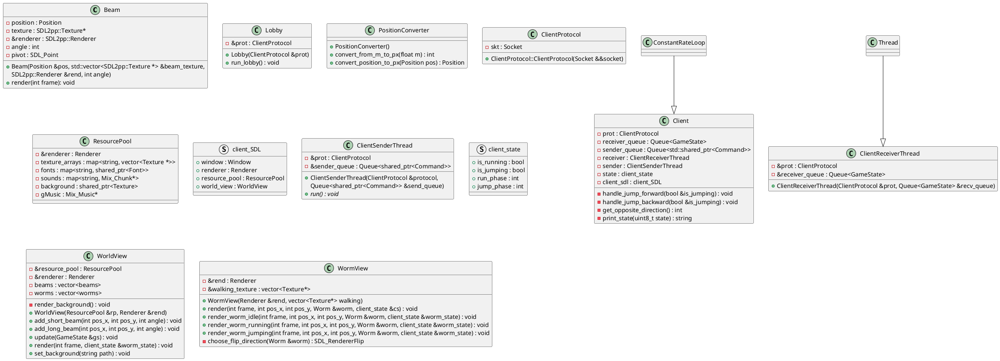

Abrir con alt+d:

Asociación (--> o --)
Agregación (o--)
Composición (*--)
Herencia (<|--)
Implementación (<|..)
Dependencia (..>)

```plantuml
@startuml
class Beam {
  - position : Position
  - texture : SDL2pp::Texture* 
  - &renderer : SDL2pp::Renderer
  - angle : int
  - pivot : SDL_Point

  + Beam(Position &pos, std::vector<SDL2pp::Texture *> &beam_texture,
       SDL2pp::Renderer &rend, int angle)
  + render(int frame): void
}

class Client {
  - prot : ClientProtocol
  - receiver_queue : Queue<GameState>
  - sender_queue : Queue<std::shared_ptr<Command>>
  - receiver : ClientReceiverThread
  - sender : ClientSenderThread
  - state : client_state
  - client_sdl : client_SDL
  - handle_jump_forward(bool &is_jumping) : void
  - handle_jump_backward(bool &is_jumping) : void
  - get_opposite_direction() : int
  - print_state(uint8_t state) : string 
}

class Lobby {
  - &prot : ClientProtocol
  + Lobby(ClientProtocol &prot)
  + run_lobby() : void

}

class PositionConverter {
  + PositionConverter()
  + convert_from_m_to_px(float m) : int
  + convert_position_to_px(Position pos) : Position

}

class ClientProtocol {
  - skt : Socket
  + ClientProtocol::ClientProtocol(Socket &&socket)
}

class ClientReceiverThread {
  - &prot : ClientProtocol
  - &receiver_queue : Queue<GameState>
  + ClientReceiverThread(ClientProtocol &prot, Queue<GameState> &recv_queue)
}

class ResourcePool {
  - &renderer : Renderer 
  - texture_arrays : map<string, vector<Texture *>> 
  - fonts : map<string, shared_ptr<Font>> 
  - sounds : map<string, Mix_Chunk*> 
  - background : shared_ptr<Texture> 
  - gMusic : Mix_Music*
}

struct client_SDL {
  + window : Window
  + renderer : Renderer
  + resource_pool : ResourcePool
  + world_view : WorldView
}

class ClientSenderThread {
  - &prot : ClientProtocol
  - &sender_queue : Queue<shared_ptr<Command>>
  + ClientSenderThread(ClientProtocol &protocol,
      Queue<shared_ptr<Command>> &send_queue)
  {abstract} + run() : void
}

struct client_state {
  + is_running : bool
  + is_jumping : bool
  + run_phase : int
  + jump_phase : int
}

class WorldView {
  - &resource_pool : ResourcePool
  - &renderer : Renderer
  - beams : vector<beams>
  - worms : vector<worms>
  - render_background() : void
  + WorldView(ResourcePool &rp, Renderer &rend)
  + add_short_beam(int pos_x, int pos_y, int angle) : void
  + add_long_beam(int pos_x, int pos_y, int angle) : void
  + update(GameState &gs) : void
  + render(int frame, client_state &worm_state) : void
  + set_background(string path) : void
}

class WormView {
  - &rend : Renderer
  - &walking_texture : vector<Texture*>
  + WormView(Renderer &rend, vector<Texture*> walking)
  + render(int frame, int pos_x, int pos_y, Worm &worm, client_state &cs) : void
  + render_worm_idle(int frame, int pos_x, int pos_y, Worm &worm, client_state &worm_state) : void
  + render_worm_running(int frame, int pos_x, int pos_y, Worm &worm, client_state &worm_state) : void
  + render_worm_jumping(int frame, int pos_x, int pos_y, Worm &worm, client_state &worm_state) : void
  - choose_flip_direction(Worm &worm) : SDL_RendererFlip
}

ConstantRateLoop --|> Client
Thread --|> ClientReceiverThread
@enduml
```