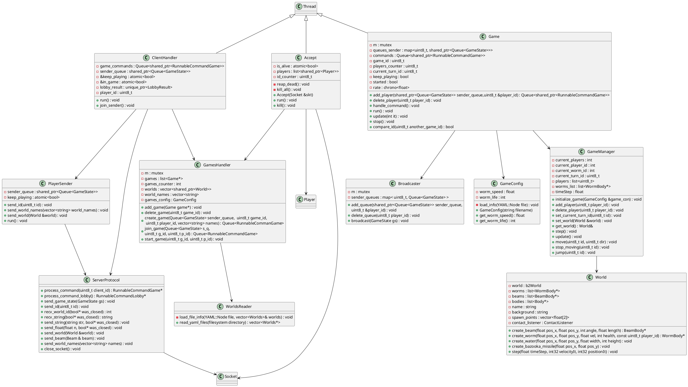

```plantuml

@startuml

class Broadcaster {
  - m : mutex
  - sender_queues : map< uint8_t, Queue<GameState> > 
  + add_queue(shared_ptr<Queue<GameState>> sender_queue,
              uint8_t &player_id) : void
  + delete_queue(uint8_t player_id) : void
  + broadcast(GameState gs) : void
}

class ClientHandler {
  - game_commands : Queue<shared_ptr<RunnableCommandGame>>
  - sender_queue : shared_ptr<Queue<GameState>>
  - &keep_playing : atomic<bool>
  - &in_game : atomic<bool>
  - lobby_result : unique_ptr<LobbyResult>
  - player_id : uint8_t
  + run() : void
  + join_sender() : void
}

'class b2ContactListener{}

'class ContactListener {
'  + BeginContact(b2Contact* contact) : 'void
'  + EndContact(b2Contact* contact) : void
'}

'class ExplosionManager {
'  - world : b2World*
'  + simulate_explosion(b2Vec2 center, 'float blastRadius, float blastPower) : 'void
'  + applyBlastImpulse(b2Body* body, 'b2Vec2 blastCenter, b2Vec2 applyPoint, 'float blastPower) : void
'}

class GameConfig {
  - worm_speed : float
  - worm_life : int
  - load_info(YAML::Node file) : void
  + GameConfig(string filename)
  + get_worm_speed() : float
  + get_worm_life() : int
}

class GameManager{
  - current_players : int
  - current_player_id : int
  - current_worm_id : int
  - current_turn_id : uint8_t
  - players : list<uint8_t>
  - worms_list : list<WormBody*>
  - timeStep : float
  + initialize_game(GameConfig &game_con) : void
  + add_player(uint8_t player_id) : void
  + delete_player(uint8_t player_id) : void
  + set_current_turn_id(uint8_t id) : void
  + set_world(World &world) : void
  + get_world() : World&
  + step() : void
  + update() : void
  + move(uint8_t id, uint8_t dir) : void
  + stop_moving(uint8_t id) : void
  + jump(uint8_t id) : void
}

'class LobbyResult {
'  - player_id : uint8_t
'  - game_id : uint8_t
'  - commands : 'Queue<shared_ptr<RunnableCommandGame>>
'  - world_names : vector<string>
'  - was_game_created : bool
'  - was_player_joined : bool
'  - was_game_started : bool
'  + get_commands() : (Queue<shared_ptr<RunnableCommandGame>>)
'}

class PlayerSender {
  - sender_queue : shared_ptr<Queue<GameState>>
  - keep_playing : atomic<bool>
  + send_id(uint8_t id) : void
  + send_world_names(vector<string> world_names) : void
  + send_world(World &world) : void
  + run() : void
}

class Accept{
  - is_alive : atomic<bool>
  - players : list<shared_ptr<Player>>
  - id_counter : uint8_t
  - reap_dead() : void
  - kill_all() : void
  + Accept(Socket &skt)
  + run() : void
  + kill() : void
}

class Game {
  - m : mutex
  - queues_sender : map<uint8_t, shared_ptr<Queue<GameState>>>
  - commands : Queue<shared_ptr<RunnableCommandGame>>
  - game_id : uint8_t
  - players_counter : uint8_t
  - current_turn_id : uint8_t
  - keep_playing : bool
  - started : bool
  - rate : chrono<float>
  + add_player(shared_ptr<Queue<GameState>> sender_queue,uint8_t &player_id) : Queue<shared_ptr<RunnableCommandGame>>
  + delete_player(uint8_t player_id) : void
  + handle_command() : void
  + run() : void
  + update(int it) : void
  + stop() : void
  + compare_id(uint8_t another_game_id) : bool
}

class GamesHandler {
  - m : mutex
  - games : list<Game*>
  - games_counter : int
  - worlds : vector<shared_ptr<World>>
  - world_names : vector<string>
  - games_config : GameConfig
  + add_game(Game game*) : void
  + delete_game(uint8_t game_id) : void
  + create_game(Queue<GameState> sender_queue,  uint8_t game_id,\n uint8_t player_id, vector<string> names) : Queue<RunnableCommanGame> 
  + join_game(Queue<GameState> s_q, \nuint8_t g_id, uint8_t p_id) : Queue<RunnableCommandGame>
  + start_game(uint8_t g_id, uint8_t p_id) : void
}

class Player {}


class ServerProtocol {
  + process_command(uint8_t client_id) : RunnableCommandGame*
  + process_command_lobby() : RunnableCommandLobby*
  + send_game_state(GameState gs) : void
  + send_id(uint8_t id) : void
  + recv_world_id(bool* was_closed) : int
  + recv_string(bool* was_closed) : string
  + send_string(string str, bool* was_closed) : void
  + send_float(float n, bool* was_closed) : void
  + send_world(World &world) : void
  + send_beam(Beam & beam) : void
  + send_world_names(vector<string> names) : void
  + close_socket() : void 
}

class World {
  - world : b2World
  - worms : list<WormBody*>
  - beams : list<BeamBody*>
  - bodies : list<Body*>
  - name : string
  - background : string
  - spawn_points : vector<float[2]>
  - contact_listener : ContactListener
  + create_beam(float pos_x, float pos_y, int angle, float length) : BeamBody*
  + create_worm(float pos_x, float pos_y, float vel, int health, const uint8_t player_id) : WormBody*
  + create_water(float pos_x, float pos_y, float width, int height) : void
  + create_bazooka_missile(float pos_x, float pos_y) : void
  + step(float timeStep, int32 velocityIt, int32 positionIt) : void
}

class WorldsReader {
  - load_file_info(YAML::Node file, vector<Worlds>& worlds) : void
  + read_yaml_files(filesystem directory) : vector<Worlds*>
}

GamesHandler --> WorldsReader

Thread <|-- Game 
Game --> Broadcaster
Game --> GameManager
Game --> GameConfig

Thread <|-- Accept
Accept --> Socket
Accept --> GamesHandler
Accept --> Player

PlayerSender --> ServerProtocol

ServerProtocol --> Socket


GameManager --> World

'b2ContactListener <|-- ContactListener

Thread <|-- ClientHandler
ClientHandler --> ServerProtocol
ClientHandler --> GamesHandler
ClientHandler --> PlayerSender

@enduml
```